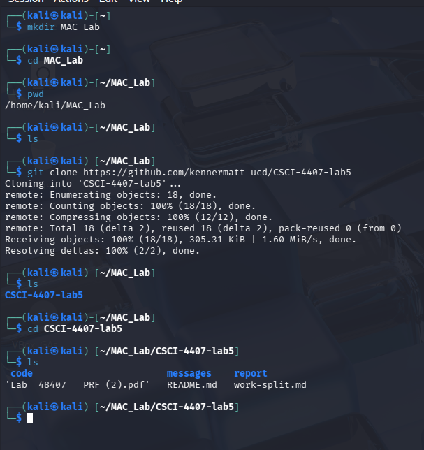
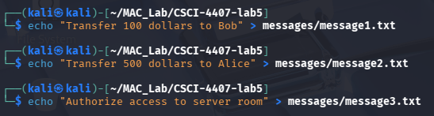
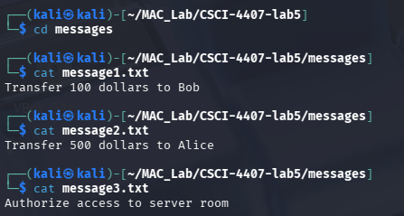
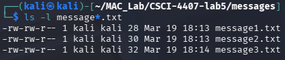
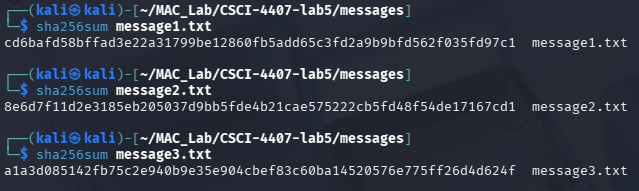
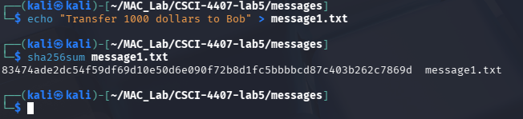
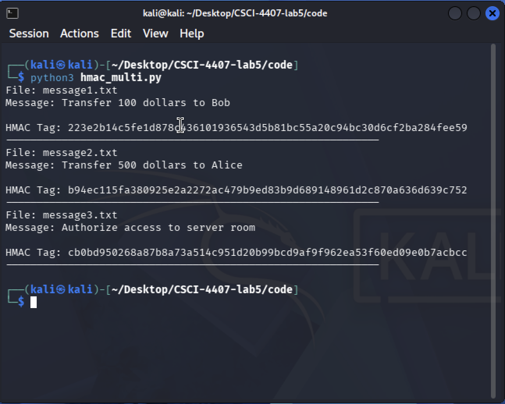
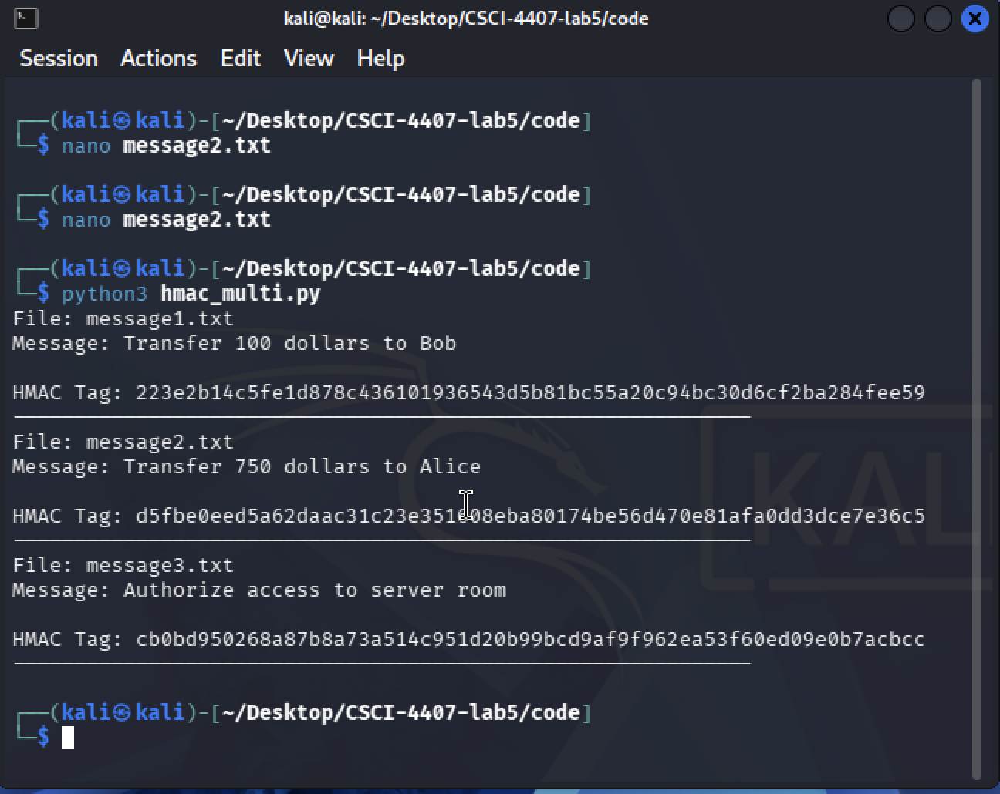

# Department of Computer Science & Engineering
## CSCI/CSCY 4407: Security & Cryptography
## Lab 5 Report: MAC, UF-CMA, CBC-MAC, HMAC & PRF

**Group Number:** Group 10
**Semester:** Spring 2026
**Instructor:** Dr. Victor Kebande
**Teaching Assistant:** Celest Kester
**Submission Date:** 03/20/2026

**Group Members:**
- Matthew Kenner
- Jonathan Le
- Cassius Kemp

---

## Table of Contents

1. [Task 1 – Lab Setup and Directory Creation](#task-1)
2. [Task 2 – Create and Inspect Sample Message Files](#task-2)
3. [Task 3 – Write and Test a Basic HMAC Generation Script](#task-3)
4. [Task 4 – Verify the Authenticity of a Message](#task-4)
5. [Task 5 – Modify the Message and Test Integrity Failure](#task-5)
6. [Task 6 – Generate HMAC Tags for Multiple Messages](#task-6)
7. [Task 7 – Change the Secret Key and Observe the Effect](#task-7)
8. [Task 8 – Replay Attack Experiment](#task-8)
9. [Task 9 – Implementing a PRF-Based Authentication Function](#task-9)

---

## Introduction

This report documents the implementation and analysis performed for Lab 5 on message authentication codes (MACs), HMAC, replay attacks, and PRF-based authentication. Each task was completed in a Linux environment using Python 3 and standard cryptographic libraries. The report includes commands executed, source code, terminal outputs, screenshots, and interpretations of results for each experiment.

## Environment

All experiments were performed in a Linux environment using Kali Linux. Python 3 was used for all scripts, and SHA-256/HMAC operations were implemented using Python's built-in `hashlib` and `hmac` libraries.

- **Operating System:** Kali Linux
- **Python Version:** Python 3.12
- **Terminal:** Kali Linux terminal
- **Installation:** Local Kali Linux install

## Files Included

The following Python source files are included in this submission:

- `hmac_gen.py` — Task 3: HMAC generation for a single message
- `hmac_verify.py` — Task 4: HMAC verification script
- `hmac_multi.py` — Task 6: HMAC generation for multiple messages
- `prf_experiment.py` — Task 9: PRF-based authentication function

---

## Task 1 – Lab Setup and Directory Creation <a name="task-1"></a>

### What Was Done

A dedicated working directory named `CSCI-4407-lab5` was created to organize all scripts, message files, and experimental outputs for this lab. The `mkdir` command created the folder, `cd` navigated into it, and `pwd` confirmed the current working path.

### Commands Executed

```bash
mkdir MAC_Lab # created and pulled from github
cd MAC_Lab
git clone https://github.com/kennermatt-ucd/CSCI-4407-lab5.git
cd CSCI-4407-lab5
pwd
ls
```

### Screenshot Evidence


> Shows terminal output of `mkdir CSCI-4407-lab5`, `cd MAC_Lab`, `pwd` displaying the full path, and `ls` confirming the directory is empty.

### Explanation

The working directory serves as the root location for all lab files. Having a dedicated folder prevents accidental overwriting of unrelated files and makes it straightforward to reproduce the experiment from a clean state. The `pwd` command confirmed we were in the correct directory before proceeding to any subsequent tasks. The team also used a shared GitHub repository to coordinate scripts, screenshots, and report drafting, although GitHub setup was not a required graded component of Task 1.

---

## Task 2 – Create and Inspect Sample Message Files <a name="task-2"></a>

### What Was Done

Three plaintext message files were created to represent realistic messages that a sender might transmit to a receiver. These files serve as the input to the authentication experiments in later tasks. The SHA-256 hash of each file was computed to demonstrate the avalanche effect: even a tiny change in a message produces a completely different hash value.

### Commands Executed

```bash
echo "Transfer 100 dollars to Bob" > message1.txt
echo "Transfer 500 dollars to Alice" > message2.txt
echo "Authorize access to server room" > message3.txt

cat message1.txt
cat message2.txt
cat message3.txt

ls -l message*.txt

sha256sum message1.txt
sha256sum message2.txt
sha256sum message3.txt

echo "Transfer 1000 dollars to Bob" > message1.txt
sha256sum message1.txt
```

### Screenshot Evidence



> Shows the three `echo` commands creating the message files and confirmation via `cat`.


> Shows `ls -l message*.txt` output with file sizes.


> Shows the SHA-256 hash values for all three original messages.


> Shows the recomputed hash of `message1.txt` after the amount was changed from 100 to 1000.

### Recorded Hash Values (Original)

| File | SHA-256 Hash |
|------|-------------|
| message1.txt | cd6bafdb58bffad3e22a31799be12860fb5add65c3fd2a9b9bfd562f035fd97c1 |
| message2.txt | 8e6d7f11d2e3185eb205037d9bb5fde4b21cae575222cb5fd48f54de17167cd1 |
| message3.txt | a1a3d085142fb75c2e940b9e35e904cbef83c60ba14520576e775ff26d4d624f |

### Recorded Hash After Modification

"Transfer 1000 dollars to Bob"

| File | SHA-256 Hash (Modified) |
|------|------------------------|
| message1.txt | 83474ade2dc54f59df69d10e50d6e090f72b8d1fc5bbbbcd87c403b262c7869d |

### Explanation

The SHA-256 hash function is a one-way cryptographic function that maps any input to a fixed-length 256-bit output. When the amount in `message1.txt` was changed from "100" to "1000", the resulting hash was completely different from the original. This demonstrates the **avalanche effect**: even a very small change in the message produces a completely different hash output. This property is fundamental to detecting message tampering, because any modification to a message will invalidate its hash or authentication tag.

---

## Task 3 – Write and Test a Basic HMAC Generation Script <a name="task-3"></a>

### What Was Done

A Python script named `hmac_gen.py` was created to compute an HMAC authentication tag for a message. HMAC uses a shared secret key combined with a cryptographic hash function (SHA-256) to produce a tag that can only be reproduced by someone who knows the key. The script was run three times: once for each message file. Between runs, the `filename` variable was changed from `message1.txt` to `message2.txt` and then to `message3.txt` to generate tags for each file separately.

### Script: hmac_gen.py

```python
import hmac
import hashlib
import sys
import os

key = b"secretkey123"

script_dir = os.path.dirname(os.path.abspath(__file__))
messages_dir = os.path.join(script_dir, "..", "messages")

filename = input("Enter message filename (e.g. message1.txt): ").strip()
filepath = os.path.join(messages_dir, filename)

with open(filepath, "rb") as f:
    message = f.read()

tag = hmac.new(key, message, hashlib.sha256).hexdigest()

print("Message:", message.decode())
print("HMAC Tag:", tag)

```

### Commands Executed

```bash
# Run 1 — filename = "message1.txt"
python3 hmac_gen.py

# Run 2 — filename changed to "message2.txt"
python3 hmac_gen.py

# Run 3 — filename changed to "message3.txt"
python3 hmac_gen.py

# Run 4 — message1.txt modified, filename = "message1.txt"
python3 hmac_gen.py
```

### Screenshot Evidence


### Recorded HMAC Tags

| File | HMAC-SHA256 Tag (key: secretkey123) |
|------|-------------------------------------|
| message1.txt | 223e2b14c5fe1d878c436101936543d5b81bc55a20c94bc30d6cf2ba284fee59 |
| message2.txt | b94ec115fa380925e2a2272ac479b9ed83b9d689148961d2c870a636d639c752 |
| message3.txt | cb0bd950268a87b8a73a514c951d20b99bcd9af9f962ea53f60ed09e0b7acbcc |
| message1.txt (modified) | 98355bb8b5bbc50272e48a98a03537aeb5f2d4a50d7be5cb2055c3d5715b4f85 |

### Step-by-Step Explanation

The script operates as follows:

1. The secret key `b"secretkey123"` is defined as a byte string. This key is shared between the sender and receiver.
2. The message file is opened and read in binary mode to ensure all byte values are handled correctly.
3. `hmac.new(key, message, hashlib.sha256)` constructs an HMAC object using SHA-256 as the underlying hash function, combining the key and message according to the HMAC construction: `HMAC(K, M) = H((K ⊕ opad) || H((K ⊕ ipad) || M))`.
4. `.hexdigest()` returns the authentication tag as a hexadecimal string, which is the value `T = T_K(M)`.
5. Both the message and tag are printed to the terminal.

### Why Different Messages Produce Different HMAC Values

Even though the same secret key is used for all three messages, each message produces a completely different HMAC tag. This occurs because the HMAC function combines both the key and the message as inputs before hashing. Since the input to the hash function changes with every different message, the output also changes. This is a required property of a secure MAC: distinct messages must produce distinct tags, so that an attacker cannot substitute one authenticated message for another.

### Effect of Modifying a Message

When `message1.txt` was modified slightly (for example, changing the dollar amount), the resulting HMAC tag changed entirely. This confirms the avalanche effect operates through the HMAC computation: even a one-character difference in the message causes the tag to be completely unrelated to the original. This behavior is what allows a receiver to detect any tampering with an authenticated message.

---

## Task 4 – Verify the Authenticity of a Message <a name="task-4"></a>

### What Was Done

A Python verification script `hmac_verify.py` was implemented to check whether a received message-tag pair is valid. The script recomputes the HMAC tag from the current file contents using the same secret key and uses `hmac.compare_digest` for a timing-safe comparison against the provided tag. Four scenarios were tested: correct tag, wrong tag, modified message with original tag, and verification repeated for `message2.txt`.

### Script: hmac_verify.py

```python
import hmac
import hashlib

key = b"secretkey123"
filename = "message1.txt"
provided_tag = input("Enter the received HMAC tag: ").strip()

with open(filename, "rb") as f:
    message = f.read()

computed_tag = hmac.new(key, message, hashlib.sha256).hexdigest()

if hmac.compare_digest(provided_tag, computed_tag):
    print("Verification successful: Message is authentic.")
else:
    print("Verification failed: Message has been altered or tag is invalid.")
```

### Commands Executed

```bash
python3 hmac_verify.py
# Test 1: entered the correct HMAC tag from Task 3 → expected: success
# Test 2: entered the tag with one character changed → expected: failure
# Test 3: modified message1.txt, then entered the original tag → expected: failure
# Test 4: changed filename to message2.txt, entered correct tag → expected: success
```

### Screenshot Evidence

> **[SCREENSHOT: task4_verify_success.png]**
> Shows the script accepting the correct HMAC tag and printing "Verification successful: Message is authentic."

> **[SCREENSHOT: task4_verify_wrong_tag.png]**
> Shows the script rejecting an incorrect tag (one character changed) and printing the failure message.

> **[SCREENSHOT: task4_verify_modified_message.png]**
> Shows the script rejecting the original tag when the message file was modified.

> **[SCREENSHOT: task4_verify_msg2.png]**
> Shows verification repeated for `message2.txt` with its correct tag.

### Explanation

HMAC verification enforces message integrity and authenticity through a recomputation approach. When the receiver gets the pair `(M, T)`, it independently computes `T_K(M)` using the same secret key. If the result matches `T`, the message is accepted; otherwise it is rejected.

The use of `hmac.compare_digest` rather than a simple `==` comparison is important for security: it performs the comparison in constant time, preventing **timing attacks** where an attacker could infer partial tag values based on how quickly the comparison returns.

When a wrong tag was submitted, the verification correctly failed, demonstrating that an attacker cannot guess or fabricate a valid tag without knowing the key. When the message was modified but the original tag was used, verification also failed, confirming that any change to the message content invalidates the tag.

---

## Task 5 – Modify the Message and Test Integrity Failure <a name="task-5"></a>

### What Was Done

A message tampering experiment was conducted to demonstrate that a MAC detects unauthorized modifications. The original HMAC tag from Task 3 was used as the reference. The message file was modified three times, and the verification script was run after each modification using the original tag. All three attempts failed verification.

### Commands Executed

```bash
# Restore original message
echo "Transfer 100 dollars to Bob" > message1.txt
cat message1.txt

# Modification 1
echo "Transfer 9000 dollars to Eve" > message1.txt
python3 hmac_verify.py

# Modification 2
echo "Transfer 100 dollars to Eve" > message1.txt
python3 hmac_verify.py

# Modification 3
echo "Transfer 100 dollars to Bob immediately" > message1.txt
python3 hmac_verify.py
```

### Screenshot Evidence

> **[SCREENSHOT: task5_tamper1.png]**
> Shows the first modified message content and the verification failure output.

> **[SCREENSHOT: task5_tamper2.png]**
> Shows the second modification and verification failure.

> **[SCREENSHOT: task5_tamper3.png]**
> Shows the third modification and verification failure.

### Explanation

In every case, the verification script printed "Verification failed: Message has been altered or tag is invalid." This occurred because the HMAC tag is computed from the exact bytes of the message. When the message changes, the recomputed tag no longer matches the original tag `T`. The receiver therefore correctly identifies that the message was tampered with.

This experiment demonstrates a core security property of MACs: they provide **integrity protection**. An attacker who intercepts a message and modifies its content cannot produce a valid tag for the altered message without knowing the secret key. Since the secret key is shared only by the legitimate communicating parties, a matching tag gives the receiver confidence that the message was not altered and was generated by someone possessing the shared key.

---

## Task 6 – Generate HMAC Tags for Multiple Messages <a name="task-6"></a>

### What Was Done

A script `hmac_multi.py` was created to automatically compute HMAC tags for all three message files in a single run. This task demonstrates that the same key consistently produces different tags for different messages. One message was then modified slightly, and the script was rerun to confirm the tag change.

### Script: hmac_multi.py

```python
import hmac
import hashlib

key = b"secretkey123"
files = ["message1.txt", "message2.txt", "message3.txt"]

for filename in files:
    with open(filename, "rb") as f:
        message = f.read()

    tag = hmac.new(key, message, hashlib.sha256).hexdigest()

    print("File:", filename)
    print("Message:", message.decode())
    print("HMAC Tag:", tag)
    print("-" * 60)
```

### Commands Executed

```bash
python3 hmac_multi.py

# Modify message2.txt slightly, then rerun
nano message2.txt
python3 hmac_multi.py
```

### Screenshot Evidence


> **[SCREENSHOT: task6_multi_output.png]**
> Shows execution of `hmac_multi.py` with HMAC tags for all three messages.



> **[SCREENSHOT: task6_modified_output.png]**
> Shows execution after `message2.txt` was slightly modified, with the changed tag.



### Comparison of Authentication Tags

| Message File | Original Tag | Tag After Modification |
|-------------|-------------|----------------------|
| message1.txt | 223e2b14c5fe1d878c436101936543d5b81bc55a20c94bc30d6cf2ba284fee59 | (unchanged) |
| message2.txt | b94ec115fa380925e2a272ac479b9ed83b9d689148961d2c870a636d639c752 | d5fbe0eed5a62daac31c23e351e08eba80174be56d470e81afa0dd3dce7e36c5 |
| message3.txt | cb0bd950268a87b8a73a514c951d20b99bcd9af9f962ea53f60ed09e0b7acbcc | (unchanged) |
### Explanation

Each message produces a distinct HMAC tag even though the same key is used for all three. This is a consequence of HMAC's design: the message content is one of the inputs to the hash function, so different message inputs yield different hash outputs. This property is necessary for a MAC to be useful — if two different messages could produce the same tag, an attacker could substitute one message for another while keeping the valid tag.

After modifying a single word in `message2.txt`, the generated tag changed completely. This behavior prevents message forgery: an attacker who wants to tamper with a message and keep it valid would need to produce a new correct tag, which requires knowing the secret key.  Even when the same key is used, different messages produce different HMAC tags because the message itself is part of the hash input, so any change in the message results in a completely different output.

---

## Task 7 – Change the Secret Key and Observe the Effect <a name="task-7"></a>

### What Was Done

The secret key in `hmac_multi.py` was changed twice and the script was rerun each time using the same message files. This experiment demonstrates that the authentication tag depends on both the message and the key. Without the correct key, an attacker cannot generate valid tags or verify messages.

### Commands Executed

```bash
# Key change 1: set key = b"newsecret456" in hmac_multi.py
nano hmac_multi.py
python3 hmac_multi.py

# Key change 2: set key = b"group10key2026" in hmac_multi.py
nano hmac_multi.py
python3 hmac_multi.py
```

### Screenshot Evidence

> **[SCREENSHOT: task7_key_change1.png]**
> Shows output with `newsecret456` — all tags differ from the originals.

> **[SCREENSHOT: task7_key_change2.png]**
> Shows output with `group10key2026` — all tags differ again.

### Comparison of Tags Across Keys

| Message | Key: secretkey123 | Key: newsecret456 | Key: group10key2026 |
|---------|-------------------|-------------------|---------------------|
| message1.txt | [PASTE] | [PASTE] | [PASTE] |
| message2.txt | [PASTE] | [PASTE] | [PASTE] |
| message3.txt | [PASTE] | [PASTE] | [PASTE] |

### Explanation

The HMAC construction incorporates the secret key at two levels: before and after the inner hash computation. As a result, the authentication tag is uniquely determined by the combination of key and message. When the key changes, the tag changes completely even if the message remains the same.

This property is critical for security. Because the tag depends on the key, an attacker who does not know the key cannot compute the correct tag for any message, including messages the attacker has never seen. Even if an adversary collects many valid `(M, T)` pairs, they cannot produce a valid tag for a new message without access to the secret key.

Keeping the secret key private is therefore the foundation of MAC security. If the key is compromised, the entire authentication mechanism fails, as any party with the key can generate valid tags for arbitrary messages.

---

## Task 8 – Replay Attack Experiment <a name="task-8"></a>

### What Was Done

A replay attack was simulated to demonstrate a fundamental limitation of MACs: they verify message integrity and authenticity, but they do not guarantee **freshness**. An attacker who captures a valid `(M, T)` pair can resubmit it at any time and a MAC-only verifier will accept it, because the tag is still mathematically correct.

### Commands Executed

```bash
# Restore original message
echo "Transfer 100 dollars to Bob" > message1.txt
cat message1.txt

# Generate tag
python3 hmac_gen.py

# First verification (legitimate)
python3 hmac_verify.py   # enter the tag above

# Second verification (replay)
python3 hmac_verify.py   # enter the same tag again

# Third verification (replay again)
python3 hmac_verify.py   # enter the same tag a third time

# Add timestamp to message
echo "Timestamp: 1700000000 | Transfer 100 dollars to Bob" > message1.txt
cat message1.txt
python3 hmac_gen.py

# Verify updated message
python3 hmac_verify.py   # enter the new tag
```

### Screenshot Evidence

> **[SCREENSHOT: task8_original_message.png]**
> Shows the restored message content.

> **[SCREENSHOT: task8_tag_generation.png]**
> Shows the HMAC tag generated for the original message. **Recorded tag:** `[PASTE TAG HERE]`

> **[SCREENSHOT: task8_verify_first.png]**
> Shows "Verification successful" for the first (legitimate) verification.

> **[SCREENSHOT: task8_replay_second.png]**
> Shows the same message accepted again on the second submission — "Verification successful."

> **[SCREENSHOT: task8_replay_third.png]**
> Shows the message accepted a third time with the same tag — "Verification successful."

> **[SCREENSHOT: task8_timestamp_message.png]**
> Shows the updated message with embedded timestamp.

> **[SCREENSHOT: task8_timestamp_tag.png]**
> Shows the new HMAC tag generated for the timestamped message.

> **[SCREENSHOT: task8_timestamp_verify.png]**
> Shows successful verification of the timestamped message with its new tag.

### Summary of Replay Results

| Attempt | Message | Tag Used | Result |
|---------|---------|----------|--------|
| First (legitimate) | Transfer 100 dollars to Bob | [TAG] | Verification successful |
| Second (replay) | Transfer 100 dollars to Bob | [TAG] | Verification successful |
| Third (replay) | Transfer 100 dollars to Bob | [TAG] | Verification successful |

### Explanation: Why the Replay Succeeds

A MAC only checks whether the tag `T` is the correct authentication value for the message `M` under the key `K`. The verification process has no memory of previous transactions: it does not record which `(M, T)` pairs have already been processed. Because the message and tag have not changed between replay attempts, the computed tag still matches the provided tag, and verification succeeds every time. This demonstrates that integrity and authenticity do not automatically imply freshness.

This attack is realistic in protocols where a valid transaction can be retransmitted. For example, an attacker could capture a "Transfer 100 dollars to Bob" packet along with its valid HMAC tag and replay it repeatedly, causing multiple unauthorized transfers.

### Discussion: Preventing Replay Attacks

To prevent replay attacks, the authenticated message must include a value that is unique to each transmission. Common approaches are:

- **Timestamps:** The sender includes the current time in the message. The receiver checks that the timestamp is recent (within an acceptable window). An old replayed message will have an outdated timestamp and be rejected.
- **Sequence numbers:** Each message includes an incrementing counter. The receiver tracks the last-seen counter and rejects any message with a counter value that is not strictly greater than the last accepted one.
- **Nonces:** The receiver generates a random challenge value (nonce) that the sender must include in the next authenticated message. Because the nonce changes with every session, a replayed message from a previous session will contain a stale nonce and be rejected.

In the timestamp experiment above, the message `"Timestamp: 1700000000 | Transfer 100 dollars to Bob"` binds the authentication tag to a specific point in time. If a receiver maintains a record of processed timestamps or enforces a freshness window, it can reject the replayed pair even if the MAC itself is valid.

---

## Task 9 – Implementing a PRF-Based Authentication Function <a name="task-9"></a>

### What Was Done

A custom PRF-based authentication script `prf_experiment.py` was implemented from scratch using `hashlib.sha256` directly rather than Python's `hmac` library. The function follows the construction `F_K(M) = SHA-256(K || M)`, where the secret key and message are concatenated before hashing. Three experiments were run: generating tags for three different messages under the same key, modifying one message and observing the tag change, and changing the key entirely and observing that all tags change.

### Script: prf_experiment.py

```python
import hashlib

def prf_authenticate(key: bytes, message: bytes) -> str:
    """
    Compute a PRF-based authentication tag for a message.
    F_K(M) = SHA-256(K || M)
    """
    combined = key + message
    digest = hashlib.sha256(combined).hexdigest()
    return digest


def run_experiment(secret_key: bytes, messages: list):
    print(f"Secret Key: {secret_key.decode()}")
    print("=" * 60)
    for msg in messages:
        tag = prf_authenticate(secret_key, msg.encode())
        print(f"Message : {msg}")
        print(f"Auth Tag: {tag}")
        print("-" * 60)
    print()


# Experiment 1: Three messages with the same key
print("=== Experiment 1: Three Messages, Same Key ===")
key1 = b"myGroupKey789"
messages = [
    "Transfer 100 dollars to Bob",
    "Transfer 500 dollars to Alice",
    "Authorize access to server room",
]
run_experiment(key1, messages)

# Experiment 2: Modify one message
print("=== Experiment 2: Modified Message ===")
modified_messages = [
    "Transfer 100 dollars to Bob",
    "Transfer 999 dollars to Bob",
    "Authorize access to server room",
]
run_experiment(key1, modified_messages)

# Experiment 3: Different key, same messages
print("=== Experiment 3: Different Key, Same Messages ===")
key2 = b"differentKey321"
run_experiment(key2, messages)
```

### Commands Executed

```bash
python3 prf_experiment.py
```

### Screenshot Evidence

> **[SCREENSHOT: task9_prf_script.png]**
> Shows the full `prf_experiment.py` script in the terminal.

> **[SCREENSHOT: task9_experiment1.png]**
> Shows authentication tags for all three original messages using `myGroupKey789`.

> **[SCREENSHOT: task9_experiment2.png]**
> Shows how the tag for the second message changes after modifying the amount from 500 to 999.

> **[SCREENSHOT: task9_experiment3.png]**
> Shows how all tags change when the key is switched to `differentKey321`.

### Recorded Results

**Experiment 1 – Original Messages, Key: myGroupKey789**

| Message | Auth Tag |
|---------|---------|
| Transfer 100 dollars to Bob | [PASTE] |
| Transfer 500 dollars to Alice | [PASTE] |
| Authorize access to server room | [PASTE] |

**Experiment 2 – Modified Message 2, Same Key**

| Message | Auth Tag |
|---------|---------|
| Transfer 100 dollars to Bob | [PASTE — same as Exp 1] |
| Transfer 999 dollars to Bob | [PASTE — different from Exp 1] |
| Authorize access to server room | [PASTE — same as Exp 1] |

**Experiment 3 – Original Messages, Key: differentKey321**

| Message | Auth Tag |
|---------|---------|
| Transfer 100 dollars to Bob | [PASTE — different from Exp 1] |
| Transfer 500 dollars to Alice | [PASTE — different from Exp 1] |
| Authorize access to server room | [PASTE — different from Exp 1] |

### Analysis Questions

**What happens to the authentication output when the message changes?**
When the message changes, even by a single character, the SHA-256 hash of the concatenated input `(K || M)` changes completely. This is the avalanche effect: a small difference in the input produces an entirely different output, making it impossible to predict the new tag from the old one.

**What happens when the secret key changes?**
Changing the key changes the input to the hash function from `K || M` to `K' || M`. Because `K ≠ K'`, the concatenated input is different, and the SHA-256 output changes completely for every message. The entire set of previously valid tags becomes invalid when the key changes.

**Why would it be difficult for an attacker to compute the correct output without knowing the key?**
SHA-256 is a one-way function: given the output, it is computationally infeasible to recover the input. An attacker who does not know `K` cannot compute `SHA-256(K || M)` because they do not have access to `K`. Even if the attacker observes many valid `(M, F_K(M))` pairs, they cannot work backwards to determine `K` or predict the correct tag for any new message.

**Why can a PRF be used to build a message authentication mechanism?**
A pseudorandom function produces outputs that are unpredictable to anyone who does not know the secret key. This property is useful for authentication: if the output of `F_K(M)` cannot be predicted without knowing `K`, then an attacker cannot forge a valid tag for a new message. Our experiment demonstrated this behavior — changing either the message or the key produced a completely different output, and there is no obvious pattern that would allow an attacker to compute the next tag without the key.

### Relationship Between PRFs and MACs

While `F_K(M) = SHA-256(K || M)` is a simple keyed hash construction and not the standardized HMAC design, it still demonstrates the key idea behind PRF-style authentication: the output depends on both the secret key and the message. In our experiment, changing either the message or the key produced a completely different output, which illustrates why keyed functions can support message authentication.

More generally, secure PRFs are closely related to MACs because a keyed function with unpredictable outputs can be used to authenticate messages. This lab exercise demonstrates that relationship conceptually, even though practical systems typically use standardized constructions such as HMAC rather than raw key-message concatenation.

---

## Conclusion

This lab provided hands-on experience with message authentication codes and pseudorandom functions. Through the nine tasks, the following core concepts were demonstrated:

- **Integrity and authenticity:** HMAC generates a tag that binds a message to a secret key. Any modification to the message invalidates the tag, allowing the receiver to detect tampering.
- **Unforgeability:** Without the secret key, an attacker cannot generate a valid tag for any message, including forged or modified messages.
- **Key dependence:** Changing the secret key completely changes all authentication tags, demonstrating that the security of the scheme rests entirely on the secrecy of the key.
- **Freshness limitation:** A MAC alone does not protect against replay attacks. Including a timestamp, counter, or nonce inside the authenticated message is necessary to guarantee message freshness.
- **PRF–MAC relationship:** A secure PRF can serve as a MAC. The custom `prf_experiment.py` script demonstrated this relationship using the construction `F_K(M) = SHA-256(K || M)`, showing that outputs are key-dependent and message-dependent even in a simple hand-built implementation.

---

## Pre-Submission Checklist

Use this checklist before exporting to PDF.

### Placeholders cleared
- [ ] All `[PASTE TAG HERE]` and `[PASTE HASH HERE]` replaced with actual values
- [ ] Third member name filled in
- [ ] All `[TAG]` placeholders in Task 8 table replaced

### Screenshots present
- [ ] task1_directory_setup.png
- [ ] task2_message_creation.png
- [ ] task2_file_sizes.png
- [ ] task2_hashes.png
- [ ] task2_modified_hash.png
- [ ] task3_hmac_script.png
- [ ] task3_hmac_output_msg1.png
- [ ] task3_hmac_output_msg2.png
- [ ] task3_hmac_output_msg3.png
- [ ] task3_hmac_modified.png
- [ ] task4_verify_success.png
- [ ] task4_verify_wrong_tag.png
- [ ] task4_verify_modified_message.png
- [ ] task4_verify_msg2.png
- [ ] task5_tamper1.png
- [ ] task5_tamper2.png
- [ ] task5_tamper3.png
- [ ] task6_multi_output.png
- [ ] task6_modified_output.png
- [ ] task7_key_change1.png
- [ ] task7_key_change2.png
- [ ] task8_original_message.png
- [ ] task8_tag_generation.png
- [ ] task8_verify_first.png
- [ ] task8_replay_second.png
- [ ] task8_replay_third.png
- [ ] task8_timestamp_message.png
- [ ] task8_timestamp_tag.png
- [ ] task8_timestamp_verify.png
- [ ] task9_prf_script.png
- [ ] task9_experiment1.png
- [ ] task9_experiment2.png
- [ ] task9_experiment3.png

### Content check
- [ ] Every task has: explanation + screenshot(s) + code (where applicable) + output table + interpretation
- [ ] No raw output submitted without explanation
- [ ] All code blocks are correctly formatted
- [ ] PDF exports cleanly with no broken layout

---

*End of Report*
